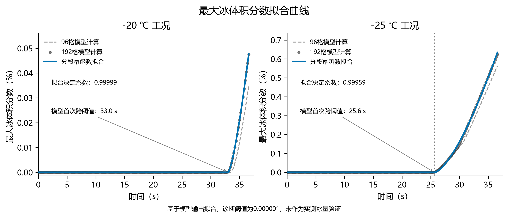

# 最大冰体积分数拟合曲线

拟合对象：两个温度下192格模型的全部184个输出点。96格结果仅作数值敏感性对照，不参与此次拟合。冰量没有实验观测，本拟合只提供轨迹的简洁近似，不是模型验证。

函数：φ(t)=A[max((t−t₀)/(36.6−t₀),0)]ᵖ，适用范围0≤t≤36.6 s；φ为无量纲总体积冰分数，图中纵轴为100φ（%）。

| 初温/℃ | A | t₀/s | p | 全程RMSE | 积冰段RMSE | 决定系数 |
|---|---:|---:|---:|---:|---:|---:|
| -20 | 0.000476301004 | 33.037749 | 1.372933 | 3.01129e-07 | 9.37098e-07 | 0.999985 |
| -25 | 0.00634770647 | 25.743935 | 1.456479 | 3.23202e-05 | 5.85853e-05 | 0.999589 |

RMSE以无量纲冰分数计；积冰段指模型φ≥10⁻⁶的采样点。拟合起点t₀是经验参数，不等于模型首次跨诊断阈值时刻，也不等于真实成核时间。全程决定系数包含长时间近零段；不能将高决定系数解读为含冰量实验验证通过。禁止用该幂函数替代守恒模型进行时间区间外或其他工况的预测。

图中每一个192格输出点均保留；没有修改原轨迹。相邻网格峰值差异仍存在。

