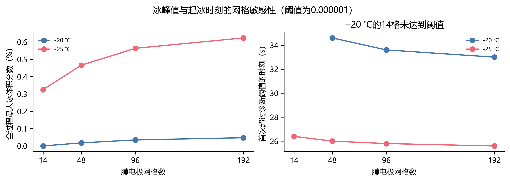
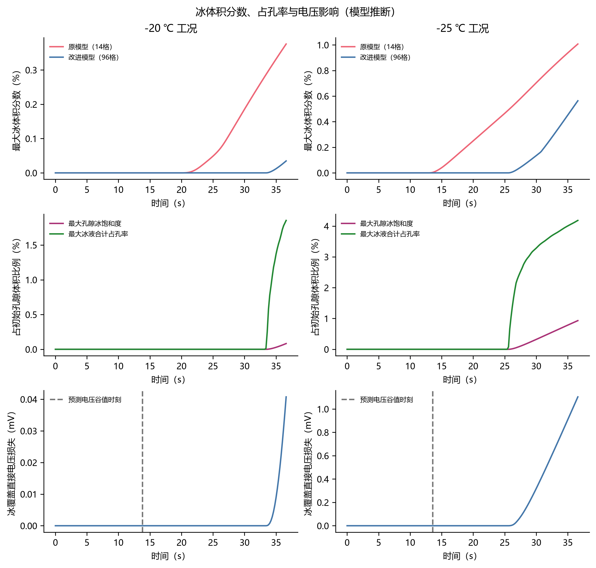
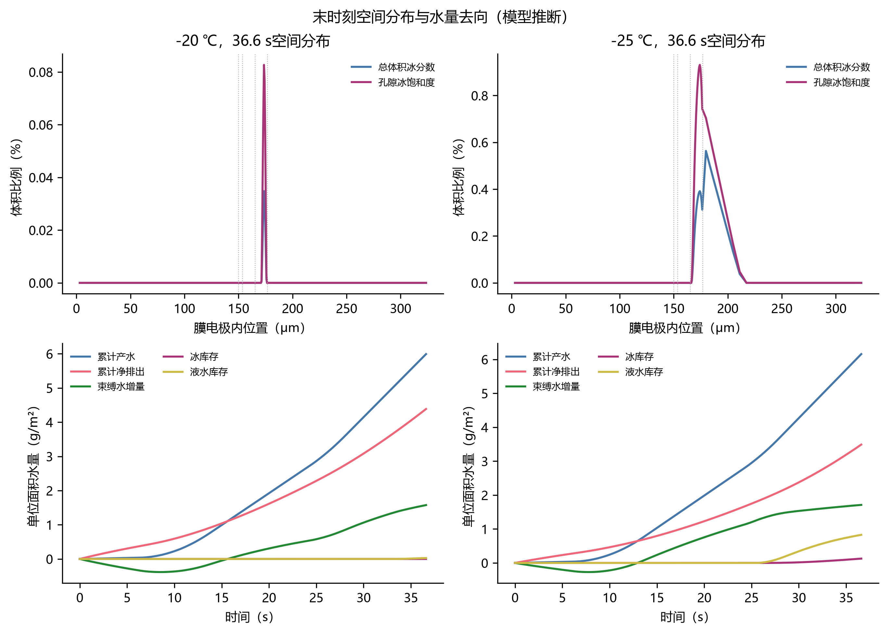

# 模型最大冰体积分数专项分析

分析对象为电压优化候选shape_joint；96格轨迹是当前候选表1、表2的来源。另用原模型14格、改进模型14/48格，以及本轮192格复算检查数值稳定性。全部数值由状态轨迹重新提取；未重新拟合参数、修改实验数据或替换冻结的Q2—Q4模型。

## 1. 首要结论

当前模型的电压先下降后回升，不能解释为“先结冰堵塞、随后融冰恢复”。预测谷值附近的冰体积分数仅约10⁻¹⁹，属于数值舍入量级；可辨识积冰出现在更晚时段。96格两工况所有膜电极网格在36.6 s内均低于0 ℃，模型融化源项始终为零。该结论针对当前模型机制，不等于已经证明真实实验没有早期结冰。

## 2. 三个统计量必须区分

- 局部总体积冰分数：φᵢ(x,t)=mᵢ(x,t)/920；mᵢ以控制体总体积为基准，单位kg/m³。题目所需最大冰体积分数是maxₖ,ₓ φᵢ(x,t)。
- 孔隙冰饱和度：sᵢ(x,t)=φᵢ(x,t)/ε₀(x)。它与总体积冰分数分母不同。
- 全过程峰值：maxₜ maxₖ,ₓ φᵢ，与表格每个指定时刻的空间最大值不同。本文峰值来自0.2 s输出采样；本轮192格保留相同采样间隔。

阴极催化层孔隙率为0.4207，阴极气体扩散层为0.8。因为孔隙率不同，全域最大φᵢ和最大sᵢ可能不在同一个网格，不能用全域max φᵢ除以某一个固定孔隙率得到全域max sᵢ。

## 3. 当前96格候选的数值

| 初温/℃ | 全过程最大φᵢ | 换算百分比 | 时刻/s | 所在层 | 位置/μm | 最大sᵢ/% |
|---|---:|---:|---:|---|---:|---:|
| -20 | 0.00034793 | 0.03479% | 36.6 | 阴极催化层 | 173.592 | 0.08270% |
| -25 | 0.00563555 | 0.56355% | 36.6 | 阴极气体扩散层 | 179.825 | 0.93086% |

位置以阳极气体扩散层外侧为原点；各层依次为阳极扩散层0–150、阳极催化层150–153.4、膜153.4–165.4、阴极催化层165.4–176.7、阴极扩散层176.7–326.7 μm。网格中心坐标并不代表连续介质中已精确定位的峰值。

−25 ℃时最大φᵢ出现在阴极扩散层靠近催化层一侧，最大sᵢ则出现在阴极催化层。两者都很小，但不能由此推断模型已经通过实验验证。

| 初温/℃ | 首次φᵢ≥10⁻⁶的输出时刻/s | 电压谷值时刻/s | 谷值时刻φᵢ | 最大冰液合计占孔率/% |
|---|---:|---:|---:|---:|
| -20 | 33.6 | 13.8 | 1.241e-19 | 1.8539 |
| -25 | 25.8 | 13.6 | 1.453e-19 | 4.1821 |

10⁻⁶仅为本次报告区分舍入噪声与积冰的诊断阈值，不是成核阈值、实验检出限或题设约束。起冰时刻是首次跨过该阈值的0.2 s输出时刻。初态无冰；显示为0.000000不等于所有后续时刻都严格无冰。

## 4. 水为什么没有全部冻在催化层

当前闭合允许水在催化层与扩散层间迁移，也允许催化层离聚物吸水和外边界汽相排出。outlet=closed只关闭液态水外排，未关闭水蒸气外排。因此水可先被离聚物吸收或经蒸气排出，剩余液水才通过有限速率源项冻结。

以下为36.6 s单位活性面积水量，单位g/m²。排出量由累计产水减总水库存增量得到；束缚水列必须使用相对初态的增量，不能把初始膜内水再算作产水。初始自由水与冰均为零。

| 初温/℃ | 累计产水 | 累计净排出 | 束缚水增量 | 液水库存 | 冰库存 | 蒸气库存 |
|---|---:|---:|---:|---:|---:|---:|
| -20 | 5.992115 | 4.386714 | 1.576709 | 0.027729 | 0.000834 | 0.000128 |
| -25 | 6.158450 | 3.490022 | 1.711346 | 0.828906 | 0.128065 | 0.000112 |

净排出可含初态束缚水的解吸贡献，不能把它解释为对新生成水分子的溯源比例。当前边界为干气，排出量依赖该边界假设，不能直接当成实测排水能力。水量守恒残差通过仅说明数值收支自洽，不能验证相分配闭合。

冻结源项为r_f=m_l·max(273.15−T,0)/(20τ_f)，本候选τ_f=33.3076694 s沿用前轮结果，电压优化时未重估；在−20 ℃和−25 ℃恒温、孤立液水近似下，局部冻结时间常数分别为33.31 s和26.65 s，温度升高时冻结进一步变慢。这是现象学闭合，不含显式随机成核或实验测得的诱导期。

## 5. 冰对电压的作用有多大

固定每一时刻的温度、含水量、氧浓度与气孔隙率，只在活化公式中去掉(1−sᵢ)^3.5冰覆盖因子，得到如下直接压降。该诊断不是完整“无冰”反事实积分，未计入冰改变传质、热量与水分布的间接作用。

| 初温/℃ | 36.6 s冰覆盖直接压降/mV | 谷值到终点电压回升/mV | 谷值到终点活化损失下降/mV | 谷值到终点欧姆损失下降/mV |
|---|---:|---:|---:|---:|
| -20 | 0.04076 | 131.223 | 78.675 | 57.656 |
| -25 | 1.10405 | 102.124 | 62.999 | 44.714 |

原模型与改进模型曲线同时存在结构和网格差异，不能将冰量变化归因于某个单独改动。当前模型将回升主要归于含水状态和温度改善后活化、欧姆损失下降；电流在增加，而冰在末段才开始积累，且未融化。各项变化是模型内部的损失分解，不是独立实验证明的因果贡献。

## 6. 网格敏感性：最大值仍未收敛

| 初温/℃ | 膜电极网格数 | 全过程最大φᵢ | 峰值所在层 | 首次跨10⁻⁶/s |
|---|---:|---:|---|---:|
| -20 | 14 | 1.3121631e-19 | 舍入量级，无可辨识峰值 | 未达到 |
| -20 | 48 | 0.00017734006 | 阴极催化层 | 34.6 |
| -20 | 96 | 0.00034792817 | 阴极催化层 | 33.6 |
| -20 | 192 | 0.00047484681 | 阴极催化层 | 33.0 |
| -25 | 14 | 0.0032528601 | 阴极催化层 | 26.4 |
| -25 | 48 | 0.0046592648 | 阴极气体扩散层 | 26.0 |
| -25 | 96 | 0.0056355492 | 阴极气体扩散层 | 25.8 |
| -25 | 192 | 0.0062347513 | 阴极气体扩散层 | 25.6 |

48→96格改变了空间网格与时间步/容差设置，因此属于综合分辨率检查。本轮96→192格仅加密膜电极网格，板件网格、rtol=10⁻⁶、max_step=0.1 s和参数保持96格设置，用于更干净地检查空间离散误差。

- -20 ℃：96→192格峰值由0.00034792817变为0.00047484681，相对96格变化36.48%；绝对差0.000126919，折合0.0126919个百分点。
- -25 ℃：96→192格峰值由0.0056355492变为0.0062347513，相对96格变化10.63%；绝对差0.000599202，折合0.0599202个百分点。

局部最大值对窄积水区域较敏感；不能把96格的小数位当成有效精度，也不能从守恒残差很小推出局部峰值已收敛。本次未预设或放宽冰峰值验收阈值，当前精确数值仍按条件性网格结果报告。

## 7. 题设约束与下一阶段

题设0.99是总体积冰分数阈值；本题干孔隙率最高仅0.8，物理可行状态在达到0.99前已耗尽孔容。因此不能用“φᵢ<0.99”单独证明无堵塞或启动成功。应同时报告最大sᵢ、最大冰液合计占孔率、最小气孔隙率、供氧约束和全过程最低电压。

现有附件未提供直接冰量观测，τ_f也未在本轮电压优化中重新识别。后续应先给冰峰值、冰库存和起冰时间单列网格验收标准，再在固定网格下做冻结/吸附时间常数及边界湿度敏感性；若要声称冰量可信，需要独立含冰量或相态证据。当前不宜为了得到更大的冰曲线而任意调快冻结速率，也不宜因新电压拟合改善就替换Q2—Q4的模型。

## 8. 文件与复现

运行 `python refine_ice.py` 生成192格核查轨迹；随后运行 `python analyze_ice.py` 和 `python report_ice.py`。
诊断源数据：冰分数与水量逐时诊断.csv、96格冰水空间分布.csv、峰值与网格对照.csv；题设8个时刻的补充量见题目时刻冰分数补充表.csv。所有图中文字为中文。

