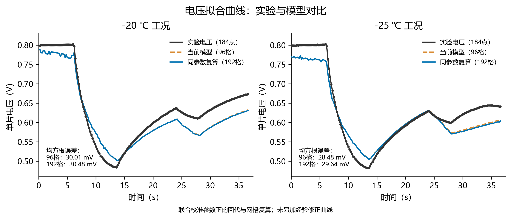

# Q1 结果

本目录为按题号整理的结果副本；全精度计算记录保存在work/outputs，完整状态轨迹保存在work/runs。

Q1保留当前电压优化候选及192格核查，Q2—Q4沿用旧冻结模型。模型分支未混用，已有未通过项与未找到可行解的结论保留。

表格目录保留本次整理时已有的题设格式表；计算表格目录同步求解器生成的结构化表。后续重新搜索后，应以计算记录和计算表格中的运行编号为准，题设格式表及其注释属于既有定稿快照。

## 表1_电压优化候选

| 时间/s | 实验电压/V | 模型电压/V | 电压相对误差/% | 实验温度/℃ | 模型温度/℃ | 温度相对误差/% | 模型最大冰体积分数 |
| --- | --- | --- | --- | --- | --- | --- | --- |
| 0 | 0.799 | 0.7895 | 1.19 | -20 | -20.00 | 0.00 | 0.000000 |
| 5 | 0.801 | 0.7672 | 4.22 | -19.96 | -20.12 | 0.82 | 0.000000 |
| 10 | 0.538 | 0.5718 | 6.29 | -19.65 | -19.77 | 0.59 | 0.000000 |
| 15 | 0.521 | 0.5198 | 0.23 | -18.41 | -18.50 | 0.49 | 0.000000 |
| 20 | 0.599 | 0.5798 | 3.20 | -17.08 | -17.37 | 1.72 | 0.000000 |
| 25 | 0.626 | 0.5942 | 5.08 | -15.90 | -16.36 | 2.90 | 0.000000 |
| 30 | 0.633 | 0.5876 | 7.18 | -14.27 | -14.79 | 3.65 | 0.000000 |
| 35 | 0.666 | 0.6236 | 6.36 | -12.67 | -13.45 | 6.19 | 0.000121 |

## 表2_电压优化候选

| 时间/s | 实验电压/V | 模型电压/V | 电压相对误差/% | 实验温度/℃ | 模型温度/℃ | 温度相对误差/% | 模型最大冰体积分数 |
| --- | --- | --- | --- | --- | --- | --- | --- |
| 0 | 0.799 | 0.7705 | 3.56 | -25 | -25.00 | 0.00 | 0.000000 |
| 5 | 0.800 | 0.7616 | 4.80 | -24.96 | -25.08 | 0.49 | 0.000000 |
| 10 | 0.537 | 0.5658 | 5.37 | -24.65 | -24.66 | 0.06 | 0.000000 |
| 15 | 0.518 | 0.5265 | 1.63 | -23.38 | -23.32 | 0.28 | 0.000000 |
| 20 | 0.592 | 0.5959 | 0.65 | -22.03 | -22.13 | 0.45 | 0.000000 |
| 25 | 0.618 | 0.6166 | 0.22 | -20.85 | -21.07 | 1.04 | 0.000000 |
| 30 | 0.621 | 0.5800 | 6.60 | -19.20 | -19.39 | 0.99 | 0.001350 |
| 35 | 0.644 | 0.5999 | 6.84 | -17.59 | -17.91 | 1.85 | 0.004515 |

冰体积分数是无量纲总体积比例；0.000000仅表示显示精度下舍入为零。
电压拟合为联合校准回代，不能表述为独立验证通过；96/192格冰峰值尚未收敛。

