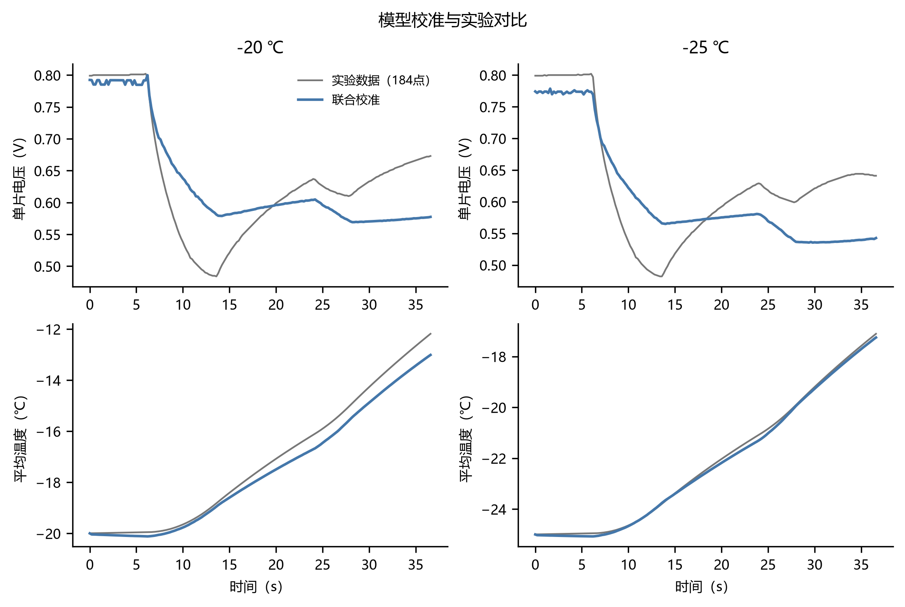
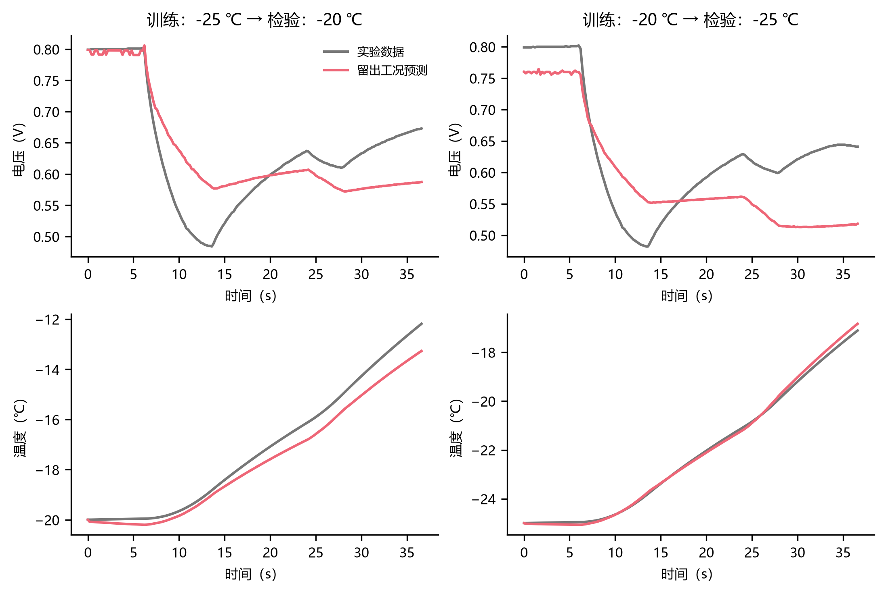
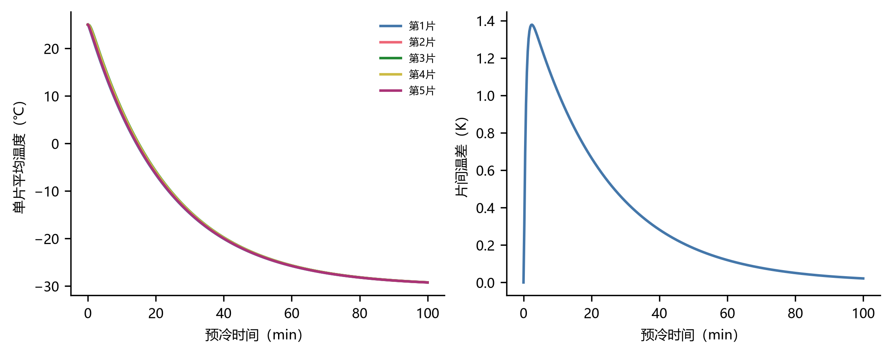
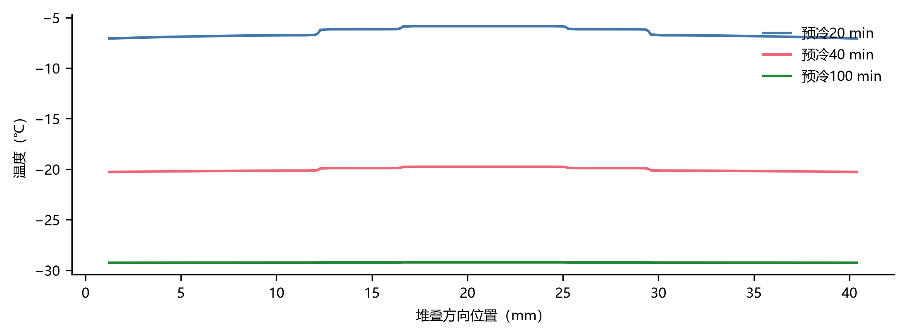

# 氢燃料电池低温冷启动：一维多相模型与条件性控制计算

## 摘要

本研究从原始题包读取两个低温实验工况，建立包含气体扩散、汽液守恒分配、膜水扩散与电渗拖曳、有限速率冻结、液水毛细迁移以及总焓传热的一维有限体积模型，并扩展到含双极板和端板的五片串联电堆。输入电流与电流密度冲突按 A/B 分支审计，热结构按 H1/H2 登记。数值实现使用隐式 BDF，分别记录物理失效、约束违反与数值失败。

**预测资格：尚未通过预先设定的跨温度电压波形验收；以下控制结果均为登记模型下的条件性计算，不是经过实验验证的工程最优策略。**

## 1 问题、数据与证据边界

附件2包含 −20℃、−25℃各184个点，时间为0—36.6 s。两条轨迹均未达到0℃，且没有局部冰、膜水、流量或加热试验。因此温度/电压可直接比较，冰场和辅助加热效果只能作为模型推断。原始 ZIP 的 SHA256 由程序强校验，输入表的源工作表与行号保留。−25℃原电流密度列实际为 I/303，−20℃不能用唯一面积和普通舍入解释；没有覆盖原数据。

四张编码前量级账如下（完整结果见同目录 CSV）。

| T0_C | basis | Q_J | dT_K | C_app |
|---|---|---|---|---|
| -20 | A | 1745.77 | 7.80946 | 223.546 |
| -20 | B | 140.143 | 7.80946 | 17.9453 |
| -25 | A | 1765.94 | 7.88604 | 223.932 |
| -25 | B | 145.704 | 7.88604 | 18.4762 |

| T0_C | basis | charge_C_cm2 | water_mg_cm2 | pore_cCL_m3_m2 | liquid_capacity_C_cm2 |
|---|---|---|---|---|---|
| -20 | A | 80.0188 | 7.46403 | 4.75391e-06 | 5.04551 |
| -20 | B | 6.4239 | 0.599211 | 4.75391e-06 | 5.04551 |
| -25 | A | 80.0188 | 7.46403 | 4.75391e-06 | 5.04551 |
| -25 | B | 6.60221 | 0.615844 | 4.75391e-06 | 5.04551 |

| T0_C | basis | t_s | j0 | V | observed_V |
|---|---|---|---|---|---|
| -20 | A | 0 | 0.01 | 0.537709 | 0.799 |
| -20 | A | 0 | 1 | 0.738634 | 0.799 |
| -20 | A | 0 | 1e+20 | 1.23988 | 0.799 |
| -20 | A | 36.6 | 0.01 | -0.357588 | 0.673 |
| -20 | A | 36.6 | 1 | -0.150465 | 0.673 |
| -20 | A | 36.6 | 1e+20 | 0.495842 | 0.673 |
| -20 | B | 0 | 0.01 | 0.668164 | 0.799 |
| -20 | B | 0 | 1 | 0.86909 | 0.799 |
| -20 | B | 0 | 1e+20 | 1.25732 | 0.799 |
| -20 | B | 36.6 | 0.01 | 0.45046 | 0.673 |
| -20 | B | 36.6 | 1 | 0.657584 | 0.673 |
| -20 | B | 36.6 | 1e+20 | 1.19075 | 0.673 |
| -25 | A | 0 | 0.01 | 0.52665 | 0.799 |
| -25 | A | 0 | 1 | 0.723607 | 0.799 |
| -25 | A | 0 | 1e+20 | 1.24238 | 0.799 |
| -25 | A | 36.6 | 0.01 | -0.433668 | 0.641 |
| -25 | A | 36.6 | 1 | -0.230452 | 0.641 |
| -25 | A | 36.6 | 1e+20 | 0.429863 | 0.641 |
| -25 | B | 0 | 0.01 | 0.652408 | 0.799 |
| -25 | B | 0 | 1 | 0.849365 | 0.799 |
| -25 | B | 0 | 1e+20 | 1.26144 | 0.799 |
| -25 | B | 36.6 | 0.01 | 0.434572 | 0.641 |
| -25 | B | 36.6 | 1 | 0.637788 | 0.641 |
| -25 | B | 36.6 | 1e+20 | 1.18801 | 0.641 |

| BP_count | thermal | C_J_m2K | L_m | k_eff | Bi | tau_min |
|---|---|---|---|---|---|---|
| 10 | effective | 109637 | 0.0416335 | 5.89202 | 0.141322 | 22.8411 |
| 10 | phase | 109637 | 0.0416335 | 2.66948 | 0.311922 | 22.8411 |
| 6 | effective | 97504 | 0.0336335 | 4.81726 | 0.139637 | 20.3133 |
| 6 | phase | 97504 | 0.0336335 | 2.16824 | 0.310238 | 20.3133 |

## 2 物理模型与明确假设

厚度方向分层顺序为 aGDL–aCL–PEM–cCL–cGDL。单片热域含两块 BP，五片主结构含10块 BP与两块端板。辅助热均匀施加于每片阴极侧BP体积，这是登记的加热位置假设，会产生方向性温差。MEA空间均温为主评价算子，同时可切换重复单元均温。气相浓度采用孔隙储量 εg c；自由水采用 mv+ml 与 mi 两个守恒库存，离聚物水另设 mb。

$$\partial_t(\epsilon_g c_a)=-\partial_xN_a+S_a,\qquad N_a=-D_{a,eff}\partial_xc_a.$$

$$\partial_t(m_v+m_l+m_i+m_b)=-\partial_x(N_v+N_l+N_b)+S_w,\qquad S_w=\frac{M_wJ}{2FL_{cCL}}.$$

汽液分配解析求解，并同时考虑液态水对气孔体积的占用。冻结、融化的速率系数分别用 −20℃、5℃参考时标参数化。没有隐式冰升华通道，W2留作需要额外文献率式的扩展。

$$r_{li}=\frac{m_l[T_m-T]_+}{20\tau_f}-\frac{m_i[T-T_m]_+}{5\tau_m},\quad\epsilon_g=\epsilon_0-\frac{m_l}{990}-\frac{m_i}{920}.$$

W1采用 Darcy 与 Leverett 型毛细压力、相对渗透率 s³以及独立登记的冰连通性衰减。CL/GDL以压差及共同通量连接，不强迫饱和度连续。液相外边界以封闭为主，压力释放排液为包络。黏度使用IAPWS在有效温区的关系，低于−20℃保持端点值并比较倍率；表面张力低于有支持的超冷范围属于外推。以上不能冒充该材料在−30℃的实测本构。

$$H=C_{dry}(T-T_m)+\sum_\alpha m_\alpha c_{p,\alpha}(T-T_m)+L_vm_v-L_fm_i.$$

总焓方程只加入反应热、辅助热、导热和质量携带焓。吸附的汽化潜热已随状态焓转移，额外结合焓基准取零；不再次叠加潜热源。反应热积分为 I(1.48−Vsim)，不使用观测电压驱动拟合温升。当前忽略气体显热库存，保留固体和水显热，属于明确的简化。

$$V=E_{rev}-\frac{RT}{\alpha F}\operatorname{asinh}\!\left(\frac{J}{2j_{0,eff}}\right)-J\left(\int_{PEM}\frac{dx}{\kappa}+R_c\right)-\eta_{con}.$$

有效反应面积按阴极CL冰饱和度衰减；总产水仍由外加电流决定。氧浓度、孔隙、电导率或膜扩散关系离开有效域时停止轨迹。代码中用于非线性迭代的有界延拓不是允许物理轨迹越界的裁剪。

题设0.99按总体积冰分数解释；材料初始孔隙率不超过0.8，所以物理孔容/供氧约束会更早生效。全过程欠压一旦触发就停止，后续回升不能把该候选重新判为成功。浓差对照关闭额外经验压降，但仍保留题给jlim边界，因此属于保守的压降闭合敏感性，不冒充已经重建完整统一传质模型。

## 3 数值实现、校准和留出检验

控制体面与材料界面重合，通量用串联阻力计算；内部通量在相邻控制体中符号相反。预冷用固定库存线性热方程的对称化特征分解求半离散解。实验输入采用分段线性重构；控制阶跃分段积分并检查左右极限。

本轮联合拟合参数：j0=0.17232760934966707 A/m²，τb=1.5400857443520637 s，τf,−20℃=33.307669427458045 s。几何、热容、λ0、Rc和h未作为自由拟合补偿量。探索范围不是统计置信区间。

A/B与H1/H2的P1分支对照如下。它是有限次局部拟合的实际结果，不是对某口径所有参数的不可行证明。

| branch | temperature | j0 | complete | V_RMSE | T_RMSE | stop_reason | last_time |
|---|---|---|---|---|---|---|---|
| A_H1_P1_train-20_-25 | -20 | 1 | False | — | — | voltage | 9.754 |
| A_H1_P1_train-20_-25 | -25 | 1 | False | — | — | voltage | 9.43602 |
| A_H2_P1_train-20_-25 | -20 | 1 | False | — | — | voltage | 9.56752 |
| A_H2_P1_train-20_-25 | -25 | 1 | False | — | — | voltage | 9.29798 |
| B_H1_P1_train-20_-25 | -20 | 0.209335 | True | 0.0619238 | 0.47074 | completed_experiment | 36.6 |
| B_H1_P1_train-20_-25 | -25 | 0.209335 | True | 0.0798271 | 0.138914 | completed_experiment | 36.6 |
| B_H2_P1_train-20_-25 | -20 | 0.27229 | True | 0.0768671 | 3.03649 | completed_experiment | 36.6 |
| B_H2_P1_train-20_-25 | -25 | 0.27229 | True | 0.10185 | 2.94624 | completed_experiment | 36.6 |

| 训练工况 | 测试温度 | 用途 | 电压RMSE | 温度RMSE | 谷值时刻误差 | 回升幅度 | 通过 |
|---|---|---|---|---|---|---|---|
| [-20, -25] | -20 | fit | 0.058583 | 0.438337 | 14.6 | 0.00825169 | False |
| [-20, -25] | -25 | fit | 0.0630139 | 0.107688 | 16.2 | 0.00720565 | False |
| [-25] | -20 | temperature_holdout | 0.0556833 | 0.554414 | 14.6 | 0.0152094 | False |
| [-25] | -25 | fit | 0.0542308 | 0.196718 | 14.4 | 0.0114753 | False |
| [-20] | -20 | fit | 0.062818 | 0.352629 | 15.2 | 0.00587031 | False |
| [-20] | -25 | temperature_holdout | 0.0732308 | 0.120285 | 16.2 | 0.00522913 | False |

两温度数据已参与建模方案设计，故这里只称参数拟合层面的留温检验，不称独立外部验证。电压谷值与回升失配会明确否决预测资格，即使某个温度RMSE较小。

表1/2的t=0温度按题面标称初温构造，因此该行温度误差为零，不是独立预测成绩。全时序核查使用附件全精度首温，保留约0.0046℃的初始残差；初始电压仍由电化学关系计算。

## 4 问题1对应结果表

### table1_Q1_-20

| time_s | experiment_V | model_V | V_relative_error_pct | experiment_T_C | model_T_C | T_relative_error_pct | max_ice_bulk |
|---|---|---|---|---|---|---|---|
| 0 | 0.799 | 0.792359 | 0.831171 | -20 | -20 | 2.84217e-13 | 0 |
| 5 | 0.801 | 0.784739 | 2.03003 | -19.96 | -20.1031 | 0.716855 | 1.80568e-20 |
| 10 | 0.538 | 0.637893 | 18.5675 | -19.65 | -19.7702 | 0.611708 | 1.48465e-20 |
| 15 | 0.521 | 0.581297 | 11.5734 | -18.41 | -18.6001 | 1.0326 | 1.02069e-19 |
| 20 | 0.599 | 0.596181 | 0.470636 | -17.08 | -17.498 | 2.44751 | 1.02013e-19 |
| 25 | 0.626 | 0.595984 | 4.7949 | -15.9 | -16.46 | 3.52194 | 0.000488271 |
| 30 | 0.633 | 0.57024 | 9.91462 | -14.27 | -14.8825 | 4.29235 | 0.00185693 |
| 35 | 0.666 | 0.575071 | 13.6529 | -12.67 | -13.4363 | 6.04809 | 0.00331817 |

### table2_Q1_-25

| time_s | experiment_V | model_V | V_relative_error_pct | experiment_T_C | model_T_C | T_relative_error_pct | max_ice_bulk |
|---|---|---|---|---|---|---|---|
| 0 | 0.799 | 0.77415 | 3.11015 | -25 | -25 | 0 | 0 |
| 5 | 0.8 | 0.773676 | 3.2905 | -24.96 | -25.0682 | 0.433457 | 1.94534e-20 |
| 10 | 0.537 | 0.621836 | 15.7982 | -24.65 | -24.6699 | 0.0808551 | 1.86682e-20 |
| 15 | 0.518 | 0.566585 | 9.37944 | -23.38 | -23.3998 | 0.0848853 | 0.000404931 |
| 20 | 0.592 | 0.575163 | 2.84407 | -22.03 | -22.1856 | 0.706494 | 0.00250046 |
| 25 | 0.618 | 0.569288 | 7.88212 | -20.85 | -21.023 | 0.829896 | 0.00465288 |
| 30 | 0.621 | 0.535812 | 13.7179 | -19.2 | -19.2719 | 0.374611 | 0.00703925 |
| 35 | 0.644 | 0.539485 | 16.229 | -17.59 | -17.7122 | 0.694788 | 0.00937599 |

## 5 问题2：三类电流与最低初温

恒流使用全范围网格，线性升载和三段阶梯使用固定随机种子的空间填充采样，并把恒流解嵌入更一般的策略族。最优仅指本次有限评估预算内找到的最好可行候选；所有失败都有事件标签。电压0.30 V是全过程历史约束，串联电荷只记一次。初温扫描区分固定策略迁移和逐温度局部重新搜索，未找到解不是严格不可行证明。

| strategy | status | startup_time_s | E_aux_J | evaluated | failure_reasons | last_valid_min_s | last_valid_max_s |
|---|---|---|---|---|---|---|---|
| constant | no_feasible_candidate_found | — | — | 80 | {"voltage": 4, "horizon": 6, "charge": 70} | 40 | 300 |
| ramp | no_feasible_candidate_found | — | — | 80 | {"charge": 79, "horizon": 1} | 43.1129 | 300 |
| step | no_feasible_candidate_found | — | — | 80 | {"charge": 74, "voltage": 6} | 39.9409 | 264.39 |

初温加密与独立网格回放如下。由于−10℃未找到可迁移的最优策略，固定参数分支标为 unoptimized_reference；reoptimized 为逐温度有限预算搜索。最低值是已采样模型条件下的候选，邻近未找到解不是严格不可行证明。

| strategy | mode | coarse_lowest_T_C | status_48 | ts_48 | status_96 | ts_96 | startup_time_agreement |
|---|---|---|---|---|---|---|---|
| constant | unoptimized_reference | -6.8 | feasible | 99.1439 | feasible | 99.0931 | True |
| constant | reoptimized | -7.9 | feasible | 45.556 | feasible | 45.453 | True |
| ramp | unoptimized_reference | -7.6 | feasible | 94.0709 | feasible | 93.9934 | True |
| ramp | reoptimized | -8.4 | feasible | 62.4788 | feasible | 62.382 | True |
| step | unoptimized_reference | -7.7 | feasible | 98.0465 | feasible | 97.9542 | True |
| step | reoptimized | -8.9 | feasible | 84.483 | feasible | 84.3041 | True |

## 6 问题3：纯预热与恒功率协同

纯预热在零电流下达到全片均温条件后关热，随后从局部加载时钟0进行60 s爬坡及10 s保持资格测试，并检查全程各片MEA均温为正。协同使用题设固定电流曲线，搜索5路功率和共同截止时刻。辅助能量只统计电热丝输入，不扣发电；协同允许先停热后达标，过程安全持续检查。20 C/cm²作为附加口径另列。

| strategy | status | startup_time_s | heat_off_s | E_aux_J | minimum_V | maximum_ice_bulk | fine_status | qualification_pass | failure_reasons |
|---|---|---|---|---|---|---|---|---|---|
| preheat | no_feasible_candidate_found | — | — | — | — | — | — | — | {"membrane": 112} |
| coheat | feasible | 358.013 | 0 | 0 | 0.450339 | 0.178016 | feasible | True | — |

原300 s时域内加热候选的48/96格比较如下，保留为启动速度对照。主表采用延长时域验证后的最细网格；启动时间一致不代表局部峰值冰已经收敛。

| mode | status_96 | time_difference_s | ice_max_48 | ice_max_96 | minimum_voltage_difference_V | time_pass | ice_relative_difference | ice_peak_5pct_pass | voltage_1mV_pass |
|---|---|---|---|---|---|---|---|---|---|
| coheat | feasible | 0.584218 | 0.0805044 | 0.0877285 | 0.00328423 | True | 0.0823459 | False | False |

### 延长时域后的零辅助热下界

在Q3/Q4不附加20 C/cm²预算的主口径下，零辅助加热在14、48、96格均完成启动；96格启动时间为 358.013 s，最低电压为 0.450339 V，电荷为 98.4039 C/cm²。由于功率约束非负，辅助能耗下界为0，零加热轨迹达到已测试离散模型下的数学下界。这一结论没有通过实验预测资格，不意味着真实电堆可无条件零加热启动。

原300 s搜索得到的约1.743 kJ候选只属于该时限内的加热方案；它保留在 q3_summary.json 和原搜索记录中，不能继续称为无时限最低辅助能耗。正式主表来自 q3_extended_summary.json。

| n_MEA | feasibility | success_time | E_aux_total_J | V_min | ice_max | charge_C_cm2 |
|---|---|---|---|---|---|---|
| 14 | feasible | 360.849 | 0 | 0.473685 | 0.131367 | 99.2546 |
| 48 | feasible | 358.818 | 0 | 0.458096 | 0.169703 | 98.6453 |
| 96 | feasible | 358.013 | 0 | 0.450339 | 0.178016 | 98.4039 |

零加热后续70 s负载资格：True。局部峰值冰的48/96格差异另见 energy_lower_bound.json，不以轨迹可行替代局部量收敛。

48/96格启动时间差 0.804806 s；最大冰含量相对差 4.67%，5%门槛状态为 True；最低电压差 7.757 mV，1 mV门槛状态为 False。因此不能声称所有局部输出均已收敛。

## 7 问题4：因果反馈与预冷

反馈只接收温度、电压、已知电流及历史量。无冰参考电压离线制表，以掩码控制有效域；查表不调用第二个在线PDE。使用因果滤波、过去窗口导数、功率限幅和连续确认关热。为节约计算，求解器可预计算一小段恒功率响应，但只依次向控制器揭示当前采样，功率改变时立即丢弃尚未使用的未来段；专门测试与逐采样重启的一致性。

实际辅助能量积分到启动加热子模式退出。官方成功、关热过渡和附加资格分别记录，不能把成功时刻当作控制器已关热。Q4表的最低电压、最大冰和最大片间温差采用到实际控制退出的完整窗口，同时在CSV保留到官方成功时刻的对应值。

其中方括号加号表示正部，Tf、Vf为因果滤波测量，R=Vf−Vref；导数项在历史不足时停用，参考无效时风险导数退回实测电压导数。逐片控制规则为：

$$u_i=\mathrm{clip}_{[0,1]}\{u_{ff}+K_T[T_{tar}-T_{f,i}]_++K_V[V_{warn}-V_{f,i}]_+-K_h[T_{f,i}-T_{off}]_++K_r[r_{min}-\dot T_{f,i}]_++K_d[-\dot R_i-d_{warn}]_+\}.$$

全部片温度、电压及风险同时满足条件并连续确认后锁存关热。表4的功率策略列按“上述规则+增益表”填写，完整控制采样与逐次功率保存在controller_log.json。登记参数如下：

| parameter | value |
|---|---|
| feedforward | 0.3 |
| KT | 0.02 |
| Kr | 0.15 |
| KV | 2 |
| Kd | 1 |
| Kh | 0.08 |
| target_C | 0.5 |
| off_C | 0.2 |
| off_V | 0.4 |
| warn_V | 0.35 |
| min_rate | 0.2 |
| warn_drop | 0.01 |
| confirmations | 3 |
| filter_tau | 0.4 |
| derivative_window | 2 |
| delay_s | 0 |
| shutdown_delay_s | 0 |
| noise_T | 0 |
| noise_V | 0 |
| seed | 42 |

| scenario | method | feasibility | success_time | th_startup | E_aux_total_J | V_min | ice_max | delta_T_max |
|---|---|---|---|---|---|---|---|---|
| equilibrium | constant_transfer | feasible | 360.849 | 0 | 0 | 0.473685 | 0.131367 | 7.34696 |
| equilibrium | constant_reoptimized | feasible | 360.849 | 0 | 0 | 0.473685 | 0.131367 | 7.34696 |
| equilibrium | dynamic_speed_tradeoff | feasible | 137.632 | 140.5 | 5263.78 | 0.565726 | 0.0103488 | 17.1998 |
| 20min | constant_transfer | feasible | 101.288 | 0 | 0 | 0.566665 | 1.41977e-20 | 7.94558 |
| 20min | constant_reoptimized | feasible | 101.288 | 0 | 0 | 0.566665 | 1.41977e-20 | 7.94558 |
| 20min | dynamic_speed_tradeoff | feasible | 38.986 | 42 | 1220.11 | 0.598704 | 9.30313e-21 | 6.19957 |
| 40min | constant_transfer | feasible | 260.4 | 0 | 0 | 0.558769 | 0.0333707 | 8.76591 |
| 40min | constant_reoptimized | feasible | 260.4 | 0 | 0 | 0.558769 | 0.0333707 | 8.76591 |
| 40min | dynamic_speed_tradeoff | feasible | 99.1721 | 102 | 3447.12 | 0.565464 | 8.45196e-20 | 12.6994 |

Q4的恒功率迁移与重优化主基线均为Q3验证后的零辅助热解，观察时域为600 s；动态反馈是启动时间与辅助能耗的折中，不能称为比零辅助热更节能。已在300 s内完成控制退出的动态轨迹可沿用，因其因果初值问题与延长观察时域无关。原加热基线及其比较保留在 q4_comparison.json，主表读取 q4_extended_comparison.json。

动态反馈的14格/0.5 s采样与48格/0.2 s采样回放比较如下；它同时改变空间与控制采样，不能称为纯空间收敛证明。主比较表使用同一粗网格，细网格结果单独披露。

| scenario | coarse_feasibility | fine_feasibility | coarse_time | fine_time | coarse_energy | fine_energy | energy_relative_difference | coarse_ice | fine_ice |
|---|---|---|---|---|---|---|---|---|---|
| equilibrium | feasible | feasible | 137.632 | 137.678 | 5263.78 | 5265.68 | 0.000360646 | 0.0103488 | 0.0116842 |
| 20min | feasible | feasible | 38.986 | 39.1259 | 1220.11 | 1218.6 | 0.00123686 | 9.30313e-21 | 4.49931e-20 |
| 40min | feasible | feasible | 99.1721 | 99.2614 | 3447.12 | 3448.22 | 0.000317343 | 8.45196e-20 | 1.62066e-20 |

## 8 验证、敏感性与可复现性

数值单元测试覆盖几何和单位、相分配与焓反演、跨层质量和能量残差、干态液水通量、热流抵消、串联电荷、跳变欠压、参考表越界以及因果关热。网格/步长比较与W0/W1对照分别保存在 mesh_convergence.csv 和 water_route_ablation.csv。参数敏感性结果见 sensitivity.csv；敏感性范围不等于实验后验分布。

| n_MEA | max_step | mass_residual | energy_residual | next_grid_V_diff | next_grid_T_diff | output_converged |
|---|---|---|---|---|---|---|
| 14 | 0.5 | 3.40091e-14 | 3.90509e-16 | 0.00353228 | 0.0201609 | False |
| 48 | 0.2 | 1.90787e-14 | 1.33412e-15 | 0.00178044 | 0.0144664 | False |
| 96 | 0.1 | 3.62535e-14 | 1.5713e-15 | 0.00110025 | 0.0101127 | False |
| 192 | 0.05 | 1.76156e-14 | 1.18589e-15 | 0.000615794 | 0.00715904 | True |
| 384 | 0.025 | 3.93452e-15 | 1.51201e-15 | — | — | — |

## 9 局限与结论

本实施将数据冲突、层间水迁移、总焓和全过程控制约束放入可重复运行的统一程序。控制表必须结合本报告的预测资格和细网格回放状态阅读。当前有限数据不足以唯一识别冻结/吸附动力学、低温毛细关系及实验夹具；不能用自由热容、任意排水或更换平均域掩盖失配。下一轮实证改进最需要准确的电流归一化、夹具和测温定义，以及膜含水量或局部冰/出口湿度等额外观测。

## 参考依据

- 原题及附件1/2（原件SHA256见 source_provenance.json）。
- [IAPWS SR6-08(2011), viscosity equation 7](https://iapws.org/technical-guidance/release/LiquidWater.download)
- [IAPWS R1-76(2014), surface tension](https://iapws.org/technical-guidance/release/Surf-H2O.download)
- PEMFC毛细迁移关系及适用限制见 configs/water_closure_registry.yaml。

## AI使用事实记录

执行日期：2026-09-23。使用Codex及Python（NumPy、SciPy、pandas、matplotlib）完成代码编写、原件读取、算术复核、数值运行、测试及报告生成。输入为原题B题.zip、附件1/2、完整建模计划与配套核查记录。采纳了分离热域与传质域、W1层间水迁移、总焓守恒和历史欠压约束；未采用任意热容补偿、无依据的排水源及“全部策略必然成功”等结论。输出处理包括原件哈希核对、单位与守恒测试、波形留温检验、网格回放和图表检查，保留运行ID与配置。人工复核状态：待队伍成员逐项确认，自动测试不替代人工审核。未声称已完整观看受访问限制的视频。

## 补充计算与交付验收

初温边界在每一段已观察到的可行性变化区加密到0.5℃和0.1℃；没有变化的区间不被误标为严格不可行。预冷启动扫描在成功状态变化处及已观察到的温差峰附近加密到1 min。温升斜率采用离线2 s局部线性比较，与在线控制器的因果窗口分开。记录见 supplementary_status.json、temperature_slope_diagnostics.json 和 mesh_ice_peak.csv。

补充阶段状态：已运行，细项见下表。

| item | execution | evidence |
|---|---|---|
| trajectory_diagnostics | recorded | [temperature_slope_diagnostics.json](temperature_slope_diagnostics.json) |
| failure_diagnostics | recorded | [failure_diagnostics.csv](failure_diagnostics.csv) |
| horizon_extension | recorded | [horizon_extension.json](horizon_extension.json) |
| q2_boundary_refinement | recorded | [q2_temperature_refined.json](q2_temperature_refined.json) |
| q2_boundary_fine | recorded | [q2_boundary_fine.json](q2_boundary_fine.json) |
| q3_control_convergence | recorded | [q3_control_convergence.json](q3_control_convergence.json) |
| q3_70s_qualification | recorded | [load_qualification.json](load_qualification.json) |
| q4_scan_refinement | recorded | [q4_precool_refined.json](q4_precool_refined.json) |
| controller_latency | recorded | [controller_latency.json](controller_latency.json) |
| q4_discretization | recorded | [q4_discretization.json](q4_discretization.json) |
| reference_trajectory_validation | recorded | [vref_trajectory_validation.json](vref_trajectory_validation.json) |
| control_robustness | recorded | [control_robustness.json](control_robustness.json) |
| extended_energy_optimum | recorded | [energy_lower_bound.json](energy_lower_bound.json) |

膜域事件表示膜水、电导或扩散经验式的有效域边界被触及；在本次干气边界下，预热时的失水会触发这类事件。它不能证明现实纯预热不存在可行方案。failure_diagnostics.csv 给出每类终止代表的逐片温度、膜水、电导率及电压损失，代表选择规则为同类中最后有效时刻最长，不称其为最优。

### 计算时域与低功率边界扩展

原搜索时域为300 s，下表保留600/1200 s探索及零加热、低功率探针。主表只按另外保存的细网格验证更新；原300 s候选不能称为整个控制域的最优。

| search | horizon_s | feasibility | stop_reason | success_time | E_aux_total_J | last_valid_time |
|---|---|---|---|---|---|---|
| q2_constant_search | 600 | infeasible | charge | — | 0 | 325.773 |
| q2_ramp_search | 600 | infeasible | charge | — | 0 | 464.776 |
| q3_coheat_search | 600 | feasible | success | 300.022 | 1771.8 | 300.022 |
| q3_coheat_domain_extension | 600 | feasible | success | 360.849 | 0 | 360.849 |
| q3_coheat_domain_extension | 600 | feasible | success | 352.669 | 250 | 352.669 |
| q3_coheat_domain_extension | 600 | feasible | success | 344.28 | 500 | 344.28 |
| q3_coheat_domain_extension | 600 | feasible | success | 329.809 | 871.576 | 329.809 |
| q3_coheat_domain_extension | 600 | feasible | success | 313.502 | 1307.36 | 313.502 |
| q3_coheat_domain_extension | 600 | feasible | success | 295.772 | 1743.15 | 295.772 |

### 扰动复核：原300 s加热候选

| paired_scenarios | constant_success | dynamic_success | qualification |
|---|---|---|---|
| 20 | 19 | 20 | conditional stress tests only |

扰动范围是登记的压力测试范围，成功频数不是实验成功率或统计后验概率。

### 扰动复核：延长时域零加热基线

| paired_scenarios | zero_constant_success | dynamic_success | scope |
|---|---|---|---|
| 20 | 20 | 20 | Registered stress cases, not a posterior probability; completed causal dynamic trajectories reused |

扰动范围是登记的压力测试范围，成功频数不是实验成功率或统计后验概率。

最后两级网格比较：最大电压差 0.000615794 V，最大温度差 0.00715904 K；按预定门槛的状态为 True。不以全局守恒精度代替局部解收敛。

最终代码与早期版本做了 22 对同输入验证轨迹的重放比较；温度、电压、终止时刻和停止原因一致性结果为 True。范围只覆盖匹配的验证工况，不声称已重新运行每个历史搜索候选。详见 version_replay_check.json。

本包包含全部源程序、配置、原题包副本、汇总表与候选评价账本，以及汇总结果轨迹和各搜索终止类型的代表轨迹。完整探索轨迹保留在工作目录 runs 中；压缩包所含轨迹以 bundle_run_manifest.json 为准。完整原件从未改写。
